# Schema walkthrough

The evaluator-facing companion to `database/schema.sql` and
`database/migrations/02..06`: the ER diagram, why every table is shaped the
way it is, the 3NF argument (including the redundancies we kept on purpose),
the SQL/MongoDB split, and where each PRD Section 9 query runs.

Everything below is taken from the DDL in the repository. If the DDL and this
page ever disagree, the DDL is right.

## 1. ER diagram

20 tables in three groups: **core entities** (PRD 7.1 baseline), **provenance**
(PRD 6.2), and **analytics results** (written by the M3/M4 jobs, re-computable
from the core tables).

```mermaid
erDiagram
    VENUE ||--o{ PAPER : "publishes (Venue_ID, SET NULL)"
    PAPER ||--o{ AUTHORSHIP : "written by"
    AUTHOR ||--o{ AUTHORSHIP : "writes"
    AUTHORSHIP ||--o{ PAPER_AUTHOR_INSTITUTION : "affiliated as"
    INSTITUTION ||--o{ PAPER_AUTHOR_INSTITUTION : "credited"
    AUTHOR ||--o{ AUTHOR_INSTITUTION : "affiliation history"
    INSTITUTION ||--o{ AUTHOR_INSTITUTION : "employs"
    PAPER ||--o{ PAPER_TOPIC : "about"
    TOPIC ||--o{ PAPER_TOPIC : "tags"
    TOPIC |o--o{ TOPIC : "Parent_Topic_ID"
    PAPER ||--o{ CITATION : "Citing_Paper_ID"
    PAPER ||--o{ CITATION : "Cited_Paper_ID"
    INSTITUTION ||--o{ COLLABORATION : "Institution_A_ID"
    INSTITUTION ||--o{ COLLABORATION : "Institution_B_ID"
    PAPER ||--o{ COLLABORATION : "evidence"
    PAPER ||--o{ PAPER_SOURCE : "provenance"

    TOPIC |o--o{ RESEARCH_COMMUNITY : "Root_Topic_ID"
    RESEARCH_COMMUNITY ||--o{ COMMUNITY_MEMBER : "has"
    AUTHOR ||--o{ COMMUNITY_MEMBER : "member of"
    TOPIC ||--o{ TOPIC_SNAPSHOT : "per year"
    TOPIC ||--o{ RESEARCH_TREND : "per year"
    TOPIC ||--o{ TOPIC_PAIR_TREND : "Topic_A_ID"
    TOPIC ||--o{ TOPIC_PAIR_TREND : "Topic_B_ID"
    AUTHOR ||--o| AUTHOR_INFLUENCE : "scored"
    AUTHOR ||--o{ AUTHOR_COMMUNITY_TIE : "ties"
    RESEARCH_COMMUNITY ||--o{ AUTHOR_COMMUNITY_TIE : "tie into"

    VENUE {
        serial Venue_ID PK
        text Venue_Name "UK with Venue_Type"
        varchar Venue_Type
        text Publisher
        varchar ISSN
    }
    INSTITUTION {
        serial Institution_ID PK
        text Institution_Name "UK with Country"
        varchar Country
        varchar ROR_ID UK
    }
    AUTHOR {
        serial Author_ID PK
        text Full_Name
        varchar ORCID UK
        varchar Openalex_Author_ID UK
        varchar Semantic_Scholar_Author_ID UK
    }
    PAPER {
        serial Paper_ID PK
        text Title
        varchar DOI UK
        smallint Publication_Year
        int Venue_ID FK
        int Citation_Count "reconciled"
        varchar Openalex_Paper_ID UK
        varchar Semantic_Scholar_Paper_ID UK
        tsvector Title_TSV "generated"
    }
    TOPIC {
        serial Topic_ID PK
        text Topic_Name UK
        int Parent_Topic_ID FK
        text Description
    }
    AUTHORSHIP {
        int Author_ID PK,FK
        int Paper_ID PK,FK
        smallint Author_Position
        bool Is_Corresponding
    }
    PAPER_AUTHOR_INSTITUTION {
        int Paper_ID PK,FK
        int Author_ID PK,FK
        int Institution_ID PK,FK
    }
    AUTHOR_INSTITUTION {
        int Author_ID PK,FK
        int Institution_ID PK,FK
        smallint Start_Year PK
        smallint End_Year
    }
    PAPER_TOPIC {
        int Paper_ID PK,FK
        int Topic_ID PK,FK
        numeric Relevance_Score "0..1"
        varchar Extraction_Method
    }
    CITATION {
        int Citing_Paper_ID PK,FK
        int Cited_Paper_ID PK,FK
        text Context
    }
    COLLABORATION {
        int Institution_A_ID PK,FK "A < B"
        int Institution_B_ID PK,FK
        int Paper_ID PK,FK
    }
    PAPER_SOURCE {
        int Paper_ID PK,FK
        varchar Source_Name PK "openalex | semantic_scholar"
        varchar Source_Record_ID
        int Source_Citation_Count
        timestamptz Fetched_At
    }
    ENTITY_RESOLUTION_QUEUE {
        serial Queue_ID PK
        varchar Entity_Type
        jsonb Candidate_A
        jsonb Candidate_B
        numeric Match_Confidence
        varchar Status
    }
    RESEARCH_COMMUNITY {
        serial Community_ID PK
        text Label
        int Root_Topic_ID FK
        timestamptz Detection_Date
        varchar Algorithm
    }
    COMMUNITY_MEMBER {
        int Community_ID PK,FK
        int Author_ID PK,FK
        numeric Membership_Score
    }
    TOPIC_SNAPSHOT {
        int Topic_ID PK,FK
        smallint Snapshot_Year PK
        int Paper_Count
        int Author_Count
        int Institution_Count
        int Citation_Count
        numeric Growth_Rate
    }
    RESEARCH_TREND {
        int Topic_ID PK,FK
        smallint Period_Year PK
        varchar Trend_Label "Emerging | Stable | Declining | Converging"
        numeric Score
        timestamptz Detection_Date
        varchar Algorithm
    }
    TOPIC_PAIR_TREND {
        int Topic_A_ID PK,FK "A < B"
        int Topic_B_ID PK,FK
        smallint Period_Year PK
        int Cooccurrence_Count
        int Prior_Cooccurrence_Count
        numeric Growth_Rate
        numeric Convergence_Score
        bool Is_Converging
        timestamptz Detection_Date
        varchar Algorithm
    }
    AUTHOR_INFLUENCE {
        int Author_ID PK,FK
        numeric Degree_Centrality
        numeric Betweenness_Centrality
        numeric Pagerank
        numeric Bridge_Score
        smallint Communities_Touched
        timestamptz Detection_Date
        varchar Algorithm
    }
    AUTHOR_COMMUNITY_TIE {
        int Author_ID PK,FK
        int Community_ID PK,FK
        numeric Tie_Weight
        numeric Tie_Share
    }
```

The PRD 7.2 relationships map directly onto this: AUTHOR M:N PAPER via
`AUTHORSHIP`, AUTHOR M:N INSTITUTION via `AUTHOR_INSTITUTION`, PAPER M:N TOPIC
via `PAPER_TOPIC`, PAPER M:N PAPER (recursive) via `CITATION`, VENUE 1:M PAPER,
TOPIC 1:M TOPIC_SNAPSHOT, AUTHOR M:N RESEARCH_COMMUNITY via `COMMUNITY_MEMBER`.

## 2. Table by table: keys and every foreign key

Legend for `ON DELETE`: **CASCADE** means the row is meaningless without its parent;
**SET NULL** means the row stands on its own and only loses an optional link.

### Core entities

| Table | Primary key | Candidate / unique keys | Why |
|---|---|---|---|
| `VENUE` | `Venue_ID` | `(Venue_Name, Venue_Type)` | The same name can be a journal and a workshop |
| `INSTITUTION` | `Institution_ID` | `ROR_ID`; `(Institution_Name, Country)` | ROR is the cross-source merge key (OpenAlex supplies it) |
| `AUTHOR` | `Author_ID` | `ORCID`, `Openalex_Author_ID`, `Semantic_Scholar_Author_ID` | Each external id may identify at most one person. Names are *not* unique, since two real "Wei Zhang"s exist |
| `PAPER` | `Paper_ID` | `DOI`, `Openalex_Paper_ID`, `Semantic_Scholar_Paper_ID` | DOI is the primary cross-source merge key (lower-cased, see the provenance checks) |
| `TOPIC` | `Topic_ID` | `Topic_Name` | Names are de-duplicated case-insensitively by the extractor |

| Foreign key | On delete | Reason |
|---|---|---|
| `PAPER.Venue_ID → VENUE` | SET NULL | A paper exists without a known venue (preprints, missing metadata) |
| `TOPIC.Parent_Topic_ID → TOPIC` | SET NULL | Self-reference for the hierarchy. Removing a parent must not delete its children |

### Junction tables (composite primary keys, as the PRD requires)

| Table | Primary key | Foreign keys (all CASCADE) | Attributes that depend on the *whole* key |
|---|---|---|---|
| `AUTHORSHIP` | `(Author_ID, Paper_ID)` | `AUTHOR`, `PAPER` | `Author_Position`, `Is_Corresponding`: a property of *this author on this paper* |
| `PAPER_AUTHOR_INSTITUTION` | `(Paper_ID, Author_ID, Institution_ID)` | composite `(Paper_ID, Author_ID) → AUTHORSHIP`; `INSTITUTION` | none (pure relationship). The composite FK means an affiliation cannot exist for an authorship that doesn't |
| `AUTHOR_INSTITUTION` | `(Author_ID, Institution_ID, Start_Year)` | `AUTHOR`, `INSTITUTION` | `End_Year`: one stint at one institution |
| `PAPER_TOPIC` | `(Paper_ID, Topic_ID)` | `PAPER`, `TOPIC` | `Relevance_Score` (CHECK 0..1), `Extraction_Method` |
| `CITATION` | `(Citing_Paper_ID, Cited_Paper_ID)` | both → `PAPER` | `Context`. CHECK forbids self-citation |
| `COLLABORATION` | `(Institution_A_ID, Institution_B_ID, Paper_ID)` | both institutions, `PAPER` | none. CHECK `A < B` stores each unordered pair once |

`CITATION`'s FKs are the PRD's "citations must reference existing papers" and
`AUTHORSHIP`'s are "authorship must reference existing authors and papers" (NFR
data integrity), enforced by the database, not by application code.

### Provenance (PRD 6.2)

| Table | Primary key | FK | Why |
|---|---|---|---|
| `PAPER_SOURCE` | `(Paper_ID, Source_Name)` | `PAPER` CASCADE | One row per source that reported the paper: its record id, its own citation count, when fetched. Source_Name is CHECK-constrained to the two adapters |
| `ENTITY_RESOLUTION_QUEUE` | `Queue_ID` | (none) | Low-confidence merge candidates waiting for review; `Status` is CHECK-constrained |

### Analytics results (M4)

| Table | Primary key | Foreign keys | Written by |
|---|---|---|---|
| `RESEARCH_COMMUNITY` | `Community_ID` | `Root_Topic_ID → TOPIC` SET NULL | `graph.communities` (F2) |
| `COMMUNITY_MEMBER` | `(Community_ID, Author_ID)` | both CASCADE | `graph.communities` |
| `TOPIC_SNAPSHOT` | `(Topic_ID, Snapshot_Year)` | `TOPIC` CASCADE | `graph.trends` (F3) |
| `RESEARCH_TREND` | `(Topic_ID, Period_Year)` | `TOPIC` CASCADE | `graph.trends`; `graph.convergence` overwrites the label with `Converging` |
| `TOPIC_PAIR_TREND` | `(Topic_A_ID, Topic_B_ID, Period_Year)` | both → `TOPIC` CASCADE; CHECK `A < B` | `graph.convergence` (F5) |
| `AUTHOR_INFLUENCE` | `Author_ID` (1:1 with AUTHOR) | `AUTHOR` CASCADE | `graph.influence` (F4) |
| `AUTHOR_COMMUNITY_TIE` | `(Author_ID, Community_ID)` | both CASCADE | `graph.influence` |

`AUTHOR_COMMUNITY_TIE → RESEARCH_COMMUNITY` is CASCADE on purpose: a
community-detection re-run replaces every community, and ties to a community
that no longer exists must go with it (then `graph.influence` is re-run).

## 3. Normalization (3NF)

**1NF: atomic values, no repeating groups.** A paper's authors, topics, sources
and citations are rows in junction tables, never lists in a column. The two
variable-shape things a paper has, its abstract/keywords and the raw API
response, are in MongoDB, not in a text-array column. The one JSONB use in
Postgres is `ENTITY_RESOLUTION_QUEUE.Candidate_A/B`. It is a review snapshot of
two whole source records whose shape differs by entity type, it is never
joined or filtered on, and it is the stated exception.

**2NF: no partial dependencies.** Only tables with composite keys can violate
2NF, and every non-key attribute in them needs the whole key. The last column
of the junction-table table above lists them. Examples: `Author_Position` is
not a property of the author or of the paper alone. `Relevance_Score` is how
much *this* paper is about *this* topic. `Source_Citation_Count` is what *this*
source said about *this* paper. Attributes that depend on only part of a key
live on the parent entity instead: an author's name is on `AUTHOR`, not on
`AUTHORSHIP`, and a topic's name is on `TOPIC`, not on `PAPER_TOPIC`.

**3NF: no transitive dependencies.** Every non-key attribute depends on the key
and nothing else:
- A paper's venue name and publisher are reached through `Venue_ID`, not copied onto `PAPER`.
- An institution's country is on `INSTITUTION`, not on authorships or collaborations.
- A community's label and root topic are on `RESEARCH_COMMUNITY`, not repeated per member.
- Per-source ids and counts are in `PAPER_SOURCE`, keyed by `(paper, source)`,
  rather than a pair of `openalex_count` / `s2_count` columns on `PAPER`.

### Redundancy we kept on purpose (be ready to defend these)

None of these is accidental. Each is either derived and recomputed as a unit,
or cross-checked by the provenance validator (`ingestion/validate_provenance.py`,
see the Methods & runs page) so that drift is reported rather than silent.

| Redundancy | Why it's there | What keeps it consistent |
|---|---|---|
| `PAPER.Citation_Count` is derivable from `PAPER_SOURCE.Source_Citation_Count` plus the reconciliation rule (prefer Semantic Scholar) | Sorting and ranking by citations on every list without a join and a rule per row | `citation_count_provenance` fails if it matches no source's count, and warns if it ignores the preferred source |
| `PAPER.Openalex_/Semantic_Scholar_Paper_ID` repeat `PAPER_SOURCE.Source_Record_ID` | UNIQUE lookup keys the loader uses to resolve cross-source references | `paper_source_id_columns` fails on any disagreement |
| `AUTHOR_INSTITUTION` overlaps `PAPER_AUTHOR_INSTITUTION` | The first is the PRD baseline (affiliation history per author). The second is the exact per-paper attribution M4 needed | Both written by the loader from the same source record |
| `COLLABORATION` is derivable from `PAPER_AUTHOR_INSTITUTION` | PRD baseline table, used as an F2 graph signal and by the Section 9 query. Materialized once, not re-derived per request | `derive_collaboration` is an idempotent `INSERT ... SELECT` from `v_paper_institution` |
| `TOPIC_SNAPSHOT`, `RESEARCH_TREND.Score`, `TOPIC_PAIR_TREND.Prior_Cooccurrence_Count` / `Convergence_Score` are aggregates of `PAPER_TOPIC` × `PAPER` | Time series the dashboard reads directly. Re-aggregating per request is exactly what a snapshot table avoids | Each job replaces its whole result in one transaction, so a snapshot is never half old, half new |
| `Detection_Date` and `Algorithm` repeat on every row of a run (a `RUN` table would normalize them) | The PRD's auditability NFR puts both on the result rows. Only one run per table is ever kept, so a `RUN` table would hold one row | Replace-in-one-transaction semantics, and `/meta/runs` cross-checks the stamps against the Mongo run summary (`mismatch` status) |
| `PAPER.Title_TSV` is derived from `Title` | Full-text index for F1 search | `GENERATED ALWAYS ... STORED`: Postgres maintains it, so it cannot drift |

## 4. SQL vs MongoDB

The rule: **anything that is joined, filtered, aggregated or constrained lives
in Postgres. Anything whose shape varies by source, or that is only ever read
whole, lives in Mongo.**

| MongoDB collection | Holds | Why not Postgres |
|---|---|---|
| `paper_metadata` (one doc per paper per source) | `abstract`, `keywords`, `embedding`, `nlp_status`, `raw_response` | Abstracts are long unstructured text and each source's keyword and raw-response shapes differ. A `$text` index over abstract + keywords is F1's third search channel. It finds "federated learning healthcare" papers whose *title* never says it |
| `graph_snapshot` (`latest`, `communities`, `trends`, `convergence`, `influence`, `provenance`) | One summary per analysis run: parameters, modularity, label evidence, counts, the provenance report | Variable-shape result blobs (PRD 6.4). Read whole by `/meta/runs`, never joined. Postgres stays authoritative for the results themselves |

If Mongo is down, search degrades to the Postgres channels (title and topic)
and the API says so in `meta.mongo`. The UI shows a notice. Analysis jobs still
write their Postgres results. This is the practical proof that the split is
real and not decorative: each store has a job the other cannot do as well, and
neither is a single point of failure for the other's data.

## 5. Indexes (NFR performance)

| NFR asks for | Index |
|---|---|
| Paper title | `idx_paper_title_tsv` (GIN full-text on `Title_TSV`), `idx_paper_title_trgm` (GIN trigram, fuzzy match during entity resolution) |
| Publication year | `idx_paper_pub_year` |
| Author name | `idx_author_name_trgm` (GIN trigram) |
| Topic name | `idx_topic_name`, `idx_topic_name_trgm` |
| Citation join columns | `idx_citation_citing`, `idx_citation_cited` (both directions of the recursive CTE) |
| Supporting | `idx_authorship_paper/author`, `idx_papertopic_topic`, `idx_paper_venue`, `idx_paper_citation_count (Citation_Count DESC, Paper_ID)`, `idx_pai_institution/author`, `idx_collab_b/paper`, `idx_topic_parent`, `idx_snapshot_year`, `idx_author_influence_bridge`, `idx_pairtrend_year`, partial `idx_pairtrend_converging ... WHERE Is_Converging` |

Measured effect: on a 3,000-paper corpus every dashboard endpoint's median
latency is under 250 ms. See `docs/evidence/README.md`.

## 6. PRD Section 9 queries: where each one runs

All of them run live from the UI at `/query-lab` (analyst role). Each screen
shows the SQL it ran; view and function bodies are fetched from Postgres
(`pg_get_viewdef` / `pg_get_functiondef`), not pasted in.

| PRD query | Database object | API | Competency shown |
|---|---|---|---|
| Authors who published on a topic in 2023–2025, with their institutions | `fn_topic_authors(topic, from, to, min_relevance)` (SQL function: recursive CTE over the topic hierarchy, then a join to `PAPER_AUTHOR_INSTITUTION`) | `GET /queries/topic-authors` | multi-way join, recursive CTE, `ARRAY_AGG ... FILTER` |
| Papers citing papers from a different research community | `v_paper_community` → `v_cross_community_citation` | `GET /queries/cross-community-citations` | view over view, `DISTINCT ON` |
| Institutions that collaborated on papers spanning two topics | `v_institution_topic_collaboration` | `GET /queries/institution-topic-collaboration` | join of `COLLABORATION` × `PAPER_TOPIC`, `GROUP BY ... HAVING COUNT(DISTINCT Topic_ID) = 2` |
| `Publication_Year → COUNT(*)` per topic | `v_topic_year_counts` | `GET /queries/topic-year-counts` | `GROUP BY` aggregation |
| Recursive citation chain A → B → C → D | `WITH RECURSIVE chain(...)` in `app/routers/papers.py`, cycle-safe via a path array, depth ≤ 5 | `GET /papers/{id}/citation-chain` | recursive CTE |

Also recursive: F1's topic channel expands a topic to all its descendants
(`WITH RECURSIVE` in `app/search.py` and `app/queries.py`).

**Security for all of the above:** every value is a bound parameter. The only
SQL text chosen at runtime is from fixed whitelists (sort orders, the two
chain directions). See "Security (M5)" in the root README.
